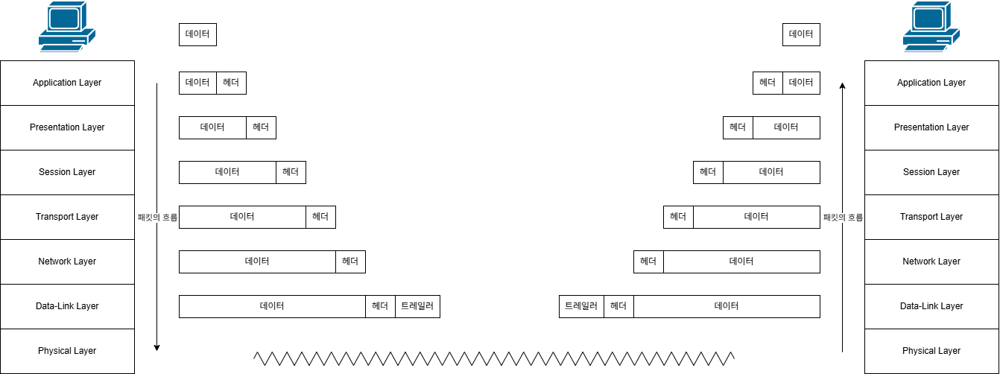

# Encapsulation / Decapsulation, PDU

## 개요
네트워크 통신에서 캡슐화(Encapsulation)는 데이터를 목적지까지 안전하고 정확하게 전달하기 위해, 전송 계층을 거칠 때마다 제어 정보(헤더, Header)를 겹겹이 덧붙이는 과정이다.
네트워크 통신에서 **캡슐화**는 송신자가 보낸 원본 데이터가 네트워크를 통해 목적지로 전송될 때, 각 네트워크 계층(OSI 또는 TCP/IP 계층)을 통과하며 통신에 필요한 제어 정보(Header, Trailer)를 덧붙여 포장하는 과정이다.

실생활에 비유하자면, 편지(데이터)를 봉투(TCP 헤더)에 넣고, 다시 택배 상자(IP 헤더)에 넣어 배송지 라벨(MAC 헤더)을 붙이는 과정과 같다.

## 예시

  

---

## 계층별 캡슐화 과정 (TCP/IP 기준)
데이터가 송신자 컴퓨터에서 출발해 물리적 매체(랜선, 와이파이 등)로 나가기까지, 위에서 아래로 내려오며 다음과 같이 데이터 단위(PDU, Protocol Data Unit)가 변환된다.

| 계층 (Layer) | 추가되는 제어 정보 | 데이터 단위 (PDU) | 핵심 역할 및 특징 |
| :--- | :--- | :--- | :--- |
| **응용 계층 (Application)** | HTTP, FTP 등 프로토콜 헤더 | Data (메시지) | 사용자가 생성한 순수한 원본 데이터 |
| **전송 계층 (Transport)** | TCP/UDP 헤더 (출발지/목적지 Port) | Segment (세그먼트) | 프로세스 식별(어떤 앱으로 갈지) 및 통신 신뢰성 제어 |
| **네트워크 계층 (Internet)** | IP 헤더 (출발지/목적지 IP) | Packet (패킷) | 최종 목적지까지 가는 최적 경로 탐색 (라우팅) |
| **데이터 링크 (Link)** | MAC 헤더 + FCS 트레일러 | Frame (프레임) | 인접 노드 간 물리적 전송 제어 및 통신 오류 검출 |
| **물리 계층 (Physical)** | (헤더 추가 없음) | Bit (비트) | 완성된 프레임을 0과 1의 전기/광/무선 신호로 변환하여 전송 |

---

## 역캡슐화 (Decapsulation)
목적지 컴퓨터에 도착한 데이터는 송신 과정의 **정확히 역순**으로 처리됩니다.
- 물리 계층에서 전기 신호를 받아 프레임으로 복원합니다.
- 상위 계층으로 올라가면서 **데이터 링크 계층(MAC) -> 네트워크 계층(IP) -> 전송 계층(TCP)** 순으로 각 계층이 자신의 헤더를 확인하고 벗겨냅니다(역캡슐화).
- 최종적으로 헤더가 모두 제거된 순수한 원본 데이터만이 응용 프로그램(웹 브라우저 등)에 안전하게 전달됩니다.

---

## 캡슐화를 사용하는 기술적 이유
네트워크에서 데이터를 통째로 보내지 않고 캡슐화 과정을 거치는 이유는 복잡한 네트워크 환경에서 **안정성, 효율성, 그리고 유연성**을 확보하기 위해 사용한다.

1. **계층 간 독립성 및 모듈화 (Layer Independence)**
   - 각 계층은 자신의 헤더 정보만 처리하며, 다른 계층의 데이터(Payload)나 작동 방식에 관여하지 않는다.
   - 이로 인해 특정 계층의 프로토콜이 변경되더라도(예: IPv4에서 IPv6로 업그레이드) 다른 계층(TCP, HTTP 등)은 수정할 필요 없이 독립적으로 동작할 수 있다.
2. **효율적인 라우팅 및 스위칭**
   - 네트워크 중간 장비들(라우터, 스위치)은 패킷의 전체 데이터를 분석할 필요 없이, 자신이 담당하는 계층의 헤더(라우터는 L3 IP 주소, 스위치는 L2 MAC 주소)만 읽고 빠르게 목적지로 데이터를 전달(포워딩)할 수 있다.
3. **데이터 보호 및 오류 검출 (Data Integrity)**
   - 데이터 링크 계층에서 덧붙이는 트레일러(FCS, Frame Check Sequence) 등을 통해 전송 중 발생할 수 있는 데이터의 손상이나 노이즈로 인한 오류를 감지하고, 폐기 혹은 재전송을 요청할 수 있다.
4. **다중화(Multiplexing) 지원**
   - 전송 계층의 헤더(Port 번호)를 통해 하나의 물리적 네트워크 연결 위에서 웹 브라우저, 메신저, 게임 등 여러 애플리케이션이 동시에 데이터를 주고받을 수 있도록 통신을 정확히 구분해 준다.

---

## PDU
각 계층에서 송수신되는 송수신되는 메시지의 단위를 PDU라고 한다.
상위계층에서 전달받은 데이터 + 자신이 속한 계층의 헤더 = 자신의 속한 계층의 PDU

주로 전송 계층 이하의 메시지를 구분하기 위해 사용한다, 전송 계층보다 높은 계층에서는 일반적으로 데이터 혹은 메시지로만 지정하는 경우가 많다.

---
