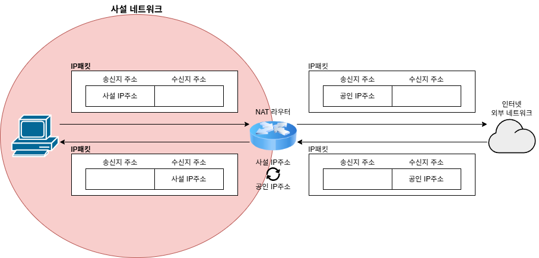

# Public, Private IP / NAT

## 개요
네트워크 상의 기기들을 식별하기 위해 부여되는 IP 주소는 용도와 접근성에 따라 **공인(Public)** 과 **사설(Private)** 로 구분된다. 

| 구분 | 공인 IP (Public IP) | 사설 IP (Private IP) |
| :--- | :--- | :--- |
| **할당 주체** | ISP (인터넷 서비스 제공자) | 라우터, 공유기 (DHCP) |
| **유일성** | 전 세계 인터넷망에서 유일함 | 내부 네트워크(LAN) 내에서만 유일함 |
| **접근성** | 외부 인터넷에서 직접 접근 가능 | 외부 인터넷에서 직접 통신 불가 |
| **주요 용도** | 웹 서버, 라우터의 외부 인터페이스 | 사내망 PC, DB 서버, 개발용 로컬 환경 |

## 사설 IP 대역

IP 주소 공간 중에서 사설 IP 주소로 사용하도록 특별히 예약된 IP 주소 공간이 있다. 
외부와 차단된 내부망을 구축할 때 아래의 약속된 대역을 사용합니다. 
* Class A: `10.0.0.0` ~ `10.255.255.255` 
* Class B: `172.16.0.0` ~ `172.31.255.255` 
* Class C: `192.168.0.0` ~ `192.168.255.255` 

---

## NAT

## 개요
사설 IP를 가진 내부망의 인스턴스들은 원칙적으로 외부 인터넷과 통신할 수 없다. 이때 **사설 IP를 공인 IP로, 공인 IP를 사설 IP로 변환해 주는 기술** 이 바로 NAT다.

## 예시

  

- **SNAT (Source NAT): 내부 ➡️ 외부 (인터넷 접속)**
  - 내부 기기가 인터넷으로 나갈 때, 패킷의 출발지(Source) 사설 IP를 라우터의 공인 IP로 변경합니다.
- **DNAT (Destination NAT): 외부 ➡️ 내부 (포트 포워딩)**
  - 외부 클라이언트가 내부 서버로 접속할 때, 패킷의 목적지(Destination) 공인 IP를 내부 서버의 사설 IP로 변경하여 트래픽을 전달합니다.
