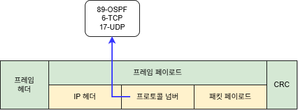

# OSPF (Open Shortest Path First)

## 개요

OSPF(Open Shortest Path First)는 Router 간에 Routing 정보를 자동으로 교환하여 Routing Table을 구성하는 **Dynamic Routing Protocol**이다.

Link-State 방식으로 동작하며, 네트워크의 전체적인 Topology 정보를 기반으로 최적의 경로를 계산한다.

OSPF는 대규모 네트워크에서도 사용할 수 있으며, RIP보다 빠른 수렴과 높은 확장성을 제공한다.

---

## OSPF란?

* Dynamic Routing Protocol
* Link-State 방식으로 동작
* IP 기반의 Routing Protocol
* 네트워크 Topology 정보를 교환
* SPF(Shortest Path First) 알고리즘 사용
* Cost를 Metric으로 사용
* Area를 이용하여 대규모 네트워크를 계층적으로 구성
* Cisco에서는 일반적으로 OSPF Process ID를 사용하여 설정

---

## OSPF 패킷

<p align="center">
  
</p>

```text
OSPF는 IP 패킷 안에 프로토콜 넘버 89(십진수)로 들어가게 된다.
즉 IP패킷만 봐도 OSPF정보임을 알 수 있다.
```

---

## OSPF 동작 방식

OSPF Router는 주변 Router와 **Hello Packet**을 교환하여 Neighbor 관계를 형성한다.

Neighbor가 형성되면 각 Router는 자신의 Link-State 정보를 교환한다.

이 정보를 기반으로 LSDB(Link-State Database)를 구성하고, SPF 알고리즘을 사용하여 최적의 경로를 계산한다.

전체적인 과정은 다음과 같다.

```text
Hello Packet 교환
      ↓
Neighbor 형성
      ↓
Link-State 정보 교환
      ↓
LSDB 구성
      ↓
SPF 알고리즘 실행
      ↓
최적 경로 계산
      ↓
Routing Table 등록
```

---

## OSPF Neighbor

OSPF는 먼저 인접한 Router와 Neighbor 관계를 형성한다.

예시

```text
Router A
   |
   | Hello Packet
   ↓
Router B
```

양쪽 Router의 OSPF 설정이 정상적으로 일치하면 Neighbor 관계가 형성된다.

대표적으로 다음 항목들이 Neighbor 형성에 영향을 준다.

* Area ID
* Hello Interval
* Dead Interval
* Network Type
* 인증 설정
* 동일한 Subnet

---

## OSPF Area

OSPF는 네트워크를 여러 개의 **Area**로 나누어 관리할 수 있다.

가장 기본적인 Area는 **Area 0**이며, 이를 Backbone Area라고 한다.

예시

```text
              Area 1
                |
                |
              Router
                |
              Area 0
            Backbone
                |
                |
              Router
                |
              Area 2
```

대규모 네트워크에서는 여러 Area를 사용하여 LSDB의 크기와 Routing 정보를 효율적으로 관리할 수 있다.

---

## Area 0

Area 0은 OSPF의 Backbone Area이다.

여러 Area를 사용하는 경우 다른 Area들은 기본적으로 Area 0을 통해 연결된다.

```text
Area 1
   |
   |
Area 0
   |
   |
Area 2
```

따라서 OSPF 네트워크를 설계할 때 Area 0을 중심으로 다른 Area를 연결하는 구조를 사용한다.

---

## OSPF Metric - Cost

OSPF는 **Cost**를 Metric으로 사용한다.

Cost가 낮은 경로를 우선적으로 선택한다.

```text
경로 A

Router A → Router B → Network
Cost = 10


경로 B

Router A → Router C → Router D → Network
Cost = 20
```

OSPF는 다음과 같이 Cost가 낮은 경로를 선택한다.

```text
10 < 20
```

기본적으로 Cisco IOS의 OSPF Cost는 Interface의 Bandwidth를 기준으로 계산된다.

일반적인 기본 공식은 다음과 같다.

```text
Cost = Reference Bandwidth / Interface Bandwidth
```

Cisco IOS에서는 기본 Reference Bandwidth가 100 Mbps로 설정되어 있다.

---

## OSPF 설정

Cisco IOS에서는 다음 명령어를 사용하여 OSPF를 설정한다.

```text
Router(config)# router ospf [Process ID]
Router(config-router)# network [Network Address] [Wildcard Mask] area [Area ID]
```

예시

```text
Router(config)# router ospf 1
Router(config-router)# network 192.168.10.0 0.0.0.255 area 0
Router(config-router)# network 10.0.0.0 0.0.0.3 area 0
```

여기서

```text
1
→ OSPF Process ID

0
→ Area 0

0.0.0.255
→ Wildcard Mask
```

이다.

Process ID는 Router 내부에서 OSPF Process를 구분하기 위한 값이며, 서로 다른 Router에서 반드시 동일할 필요는 없다.

---

## Wildcard Mask

OSPF 설정에서는 Subnet Mask 대신 **Wildcard Mask**를 사용한다.

예를 들어

```text
Subnet Mask
255.255.255.0
```

의 Wildcard Mask는

```text
0.0.0.255
```

이다.

또 다른 예시

```text
Subnet Mask
255.255.255.252
```

Wildcard Mask

```text
0.0.0.3
```

이다.

Wildcard Mask는 Subnet Mask의 각 값을 255에서 빼서 계산할 수 있다.

```text
255 - 255 = 0
255 - 255 = 0
255 - 255 = 0
255 - 252 = 3

→ 0.0.0.3
```

---

## Packet Tracer 설정 예시

다음과 같은 네트워크를 구성한다고 가정한다.

```text
192.168.10.0/24
      |
   Router A
      |
   10.0.0.0/30
      |
   Router B
      |
192.168.20.0/24
```

### Router A 설정

Interface 설정

```text
RouterA(config)# interface gigabitEthernet 0/0
RouterA(config-if)# ip address 192.168.10.1 255.255.255.0
RouterA(config-if)# no shutdown

RouterA(config)# interface gigabitEthernet 0/1
RouterA(config-if)# ip address 10.0.0.1 255.255.255.252
RouterA(config-if)# no shutdown
```

OSPF 설정

```text
RouterA(config)# router ospf 1
RouterA(config-router)# network 192.168.10.0 0.0.0.255 area 0
RouterA(config-router)# network 10.0.0.0 0.0.0.3 area 0
```

---

### Router B 설정

Interface 설정

```text
RouterB(config)# interface gigabitEthernet 0/0
RouterB(config-if)# ip address 10.0.0.2 255.255.255.252
RouterB(config-if)# no shutdown

RouterB(config)# interface gigabitEthernet 0/1
RouterB(config-if)# ip address 192.168.20.1 255.255.255.0
RouterB(config-if)# no shutdown
```

OSPF 설정

```text
RouterB(config)# router ospf 1
RouterB(config-router)# network 10.0.0.0 0.0.0.3 area 0
RouterB(config-router)# network 192.168.20.0 0.0.0.255 area 0
```

---

## OSPF Routing Table 확인

OSPF를 통해 학습한 Route는 Routing Table에서 `O`로 표시된다.

```text
Router# show ip route
```

예시

```text
O    192.168.20.0/24 [110/2] via 10.0.0.2
```

여기서

```text
O
→ OSPF를 통해 학습한 Route

110
→ Administrative Distance

2
→ OSPF Metric (Cost)
```

을 의미한다.

OSPF의 기본 Administrative Distance는 **110**이다.

---

## OSPF Neighbor 확인

OSPF Neighbor 관계를 확인하려면 다음 명령어를 사용한다.

```text
Router# show ip ospf neighbor
```

예시

```text
Neighbor ID     Pri   State           Dead Time   Address       Interface
10.0.0.2          1   FULL/ -         00:00:33    10.0.0.2      Gig0/1
```

`FULL` 상태라면 Router 간 OSPF Neighbor 관계가 정상적으로 형성되었다고 볼 수 있다.

---

## OSPF 설정 확인

OSPF Process 정보를 확인하려면 다음 명령어를 사용한다.

```text
Router# show ip protocols
```

또는

```text
Router# show ip ospf
```

를 사용할 수 있다.

예시

```text
Router# show ip ospf

Routing Process "ospf 1" with ID 10.0.0.1
Number of areas in this router is 1
```

---

## OSPF Interface 확인

특정 Interface에서 OSPF가 정상적으로 동작하는지 확인할 수 있다.

```text
Router# show ip ospf interface
```

특정 Interface만 확인하려면

```text
Router# show ip ospf interface gigabitEthernet 0/1
```

을 사용할 수 있다.

---

## LSDB 확인

OSPF는 Link-State 정보를 저장하는 **LSDB(Link-State Database)**를 사용한다.

LSDB를 확인하려면 다음 명령어를 사용한다.

```text
Router# show ip ospf database
```

이를 통해 Router가 학습한 OSPF Link-State 정보를 확인할 수 있다.

---

## OSPF 통신 테스트

OSPF가 정상적으로 Routing Table을 구성했다면 서로 다른 네트워크 간 통신이 가능하다.

PC-A에서 PC-B로 Ping을 수행한다.

```text
PC-A> ping 192.168.20.10
```

Router에서도 확인할 수 있다.

```text
RouterA# ping 192.168.20.10
```

경로를 확인하려면 다음 명령어를 사용한다.

```text
RouterA# traceroute 192.168.20.10
```

PC에서는

```text
PC> tracert 192.168.20.10
```

을 사용할 수 있다.

---

## OSPF Router ID

OSPF에서는 각 Router를 식별하기 위한 **Router ID**를 사용한다.

Router ID는 OSPF Process에서 Router를 식별하는 고유한 값이다.

확인 명령어

```text
Router# show ip ospf
```

예시

```text
Routing Process "ospf 1" with ID 1.1.1.1
```

Router ID를 직접 지정할 수도 있다.

```text
Router(config)# router ospf 1
Router(config-router)# router-id 1.1.1.1
```

설정 후 OSPF Process를 다시 시작해야 변경 사항이 적용될 수 있다.

```text
Router# clear ip ospf process
```

---

## Passive Interface

사용자 단말이 연결된 Interface에서는 OSPF Hello Packet을 전송할 필요가 없는 경우가 있다.

이때 `passive-interface`를 사용할 수 있다.

```text
Router(config)# router ospf 1
Router(config-router)# passive-interface gigabitEthernet 0/0
```

Passive Interface로 설정하면 해당 Interface를 통해 OSPF Hello Packet을 보내지 않지만, 해당 네트워크는 OSPF를 통해 광고할 수 있다.

---

## DR과 BDR

OSPF는 Broadcast Network에서 모든 Router가 서로 직접 Neighbor를 형성할 경우 불필요한 LSA 교환이 증가할 수 있다.

이를 줄이기 위해 **DR(Designated Router)**과 **BDR(Backup Designated Router)**를 선출한다.

```text
        DR
       /  \
      /    \
    R2      R3
      \    /
       \  /
        BDR
```

* **DR** : OSPF 네트워크의 중심 역할
* **BDR** : DR 장애 발생 시 대체
* 나머지 Router : DROTHER

DR/BDR은 주로 Broadcast 및 NBMA 네트워크에서 사용된다.

---

## OSPF의 장단점

### 장점

* 빠른 수렴 속도
* 대규모 네트워크에 적합
* Link-State 방식으로 네트워크 Topology를 파악
* Hop Count 제한이 없음
* Area를 이용하여 네트워크를 계층적으로 구성할 수 있음
* VLSM과 CIDR 지원
* Cost를 이용하여 경로를 선택

### 단점

* RIP보다 설정이 복잡함
* LSDB를 유지하기 위한 메모리와 CPU 자원이 필요함
* 네트워크 구조가 복잡할수록 설계가 중요함
* Area 및 DR/BDR 등의 개념을 이해해야 함

---

## RIP과 OSPF 비교

| 구분                      | RIP             | OSPF       |
| ----------------------- | --------------- | ---------- |
| 방식                      | Distance Vector | Link-State |
| Metric                  | Hop Count       | Cost       |
| 최대 Hop                  | 15              | 제한 없음      |
| 알고리즘                    | Bellman-Ford 계열 | SPF        |
| 수렴 속도                   | 느림              | 빠름         |
| Area                    | 지원하지 않음         | 지원         |
| 확장성                     | 낮음              | 높음         |
| Administrative Distance | 120             | 110        |
| Routing Table 표시        | `R`             | `O`        |
| 적합한 환경                  | 소규모             | 중·대규모      |

---

## 핵심 정리

* OSPF는 **Dynamic Routing Protocol**이다.
* **Link-State 방식**으로 동작한다.
* Router 간 Hello Packet을 교환하여 Neighbor 관계를 형성한다.
* LSDB를 구성하고 **SPF 알고리즘**을 사용하여 최적 경로를 계산한다.
* Metric으로 **Cost**를 사용한다.
* OSPF의 기본 Administrative Distance는 **110**이다.
* Routing Table에서 OSPF 경로는 `O`로 표시된다.
* Area를 사용하여 대규모 네트워크를 효율적으로 관리할 수 있다.
* **Area 0은 Backbone Area**이다.
* Broadcast Network에서는 **DR/BDR**을 선출한다.
* Cisco IOS에서는 `router ospf` 명령어를 사용하여 설정한다.
* `show ip ospf neighbor`를 사용하여 OSPF Neighbor 상태를 확인할 수 있다.
* `show ip route`를 통해 OSPF로 학습한 Routing 정보를 확인할 수 있다.
* `show ip ospf database`를 통해 OSPF LSDB를 확인할 수 있다.
