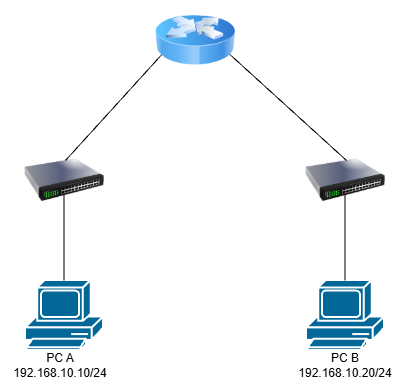
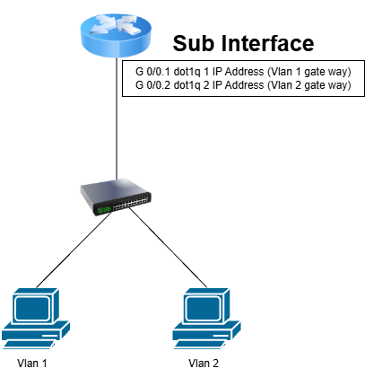

# 05. Router

## 개요

Router는 서로 다른 네트워크를 연결하고 네트워크 간의 데이터를 전달하는 **Layer 3 장비**이다.

IP Address를 기반으로 목적지 네트워크를 판단하고, Routing Table을 참고하여 최적의 경로를 통해 Packet을 전달한다.

---

## Router란?

* OSI 7계층의 Network Layer(Layer 3)에서 동작
* IP Address를 이용하여 통신
* 서로 다른 네트워크를 연결
* Routing Table을 기반으로 목적지 경로 결정
* 서로 다른 네트워크 간의 Broadcast Domain을 분리
* Packet의 목적지 IP를 확인하여 다음 홉(Next Hop)으로 전달

---

## Routing Table

Router는 Routing Table을 이용하여 목적지 네트워크로 데이터를 전달할 경로를 결정한다.

예시

```text
Network              Next Hop        Interface
------------------------------------------------
192.168.10.0/24      Directly Connected  G0/0
192.168.20.0/24      10.0.0.2           G0/1
0.0.0.0/0            10.0.0.1           G0/1
```

* **Network** : 목적지 네트워크
* **Next Hop** : 다음 Router의 주소
* **Interface** : Packet을 전달할 인터페이스
* **0.0.0.0/0** : 기본 경로(Default Route)

---

## Router 동작 과정

### 1. Packet 수신

Router는 Interface를 통해 Packet을 수신한다.

### 2. Destination IP 확인

IP Header의 목적지 IP Address를 확인한다.

### 3. Routing Table 검색

목적지 IP와 일치하는 Routing Table Entry를 검색한다.

여러 경로가 존재할 경우 **Longest Prefix Match**를 통해 가장 구체적인 경로를 선택한다.

### 4. Next Hop 결정

Routing Table을 기반으로 Packet을 전달할 다음 홉과 출력 Interface를 결정한다.

### 5. Packet Forwarding

결정된 Interface를 통해 Packet을 다음 네트워크로 전달한다.

---

## Switch와 Router의 차이

| 구분               | Switch            | Router        |
| ---------------- | ----------------- | ------------- |
| 계층               | Layer 2           | Layer 3       |
| 주요 주소            | MAC Address       | IP Address    |
| 데이터 단위           | Frame             | Packet        |
| 주요 테이블           | MAC Address Table | Routing Table |
| 주요 기능            | 동일 네트워크 내 통신      | 서로 다른 네트워크 연결 |
| Broadcast Domain | 기본적으로 동일          | 분리            |
| 주요 장비 역할         | LAN 연결            | 네트워크 간 연결     |

---
## Default Gateway

Default Gateway는 자신의 네트워크가 아닌 다른 네트워크로 통신할 때 사용하는 Router의 주소이다.

예시

```text
PC
IP Address : 192.168.10.10
Subnet Mask: 255.255.255.0
Gateway    : 192.168.10.1
```

PC가 `192.168.10.0/24`가 아닌 다른 네트워크로 통신할 경우 Packet을 `192.168.10.1` Gateway로 전달한다.

---


## Router와 Switch의 통신 과정

예를 들어 다음과 같은 네트워크가 있다고 가정한다.

<p align="center">
  
</p>


PC A가 PC B와 통신할 경우 서로 다른 네트워크에 있기 때문에 Router가 필요하다.

PC A는 목적지 IP가 자신의 네트워크인 `192.168.10.0/24`에 없다는 것을 확인하고 Default Gateway인 Router로 Packet을 전달한다.

Router는 목적지 IP `192.168.20.10`을 확인하고 Routing Table을 통해 `192.168.20.0/24` 네트워크로 전달한다.

---

## Router의 주요 기능

### Routing

Routing Table을 기반으로 목적지까지의 경로를 결정한다.

### Inter-VLAN Routing

서로 다른 VLAN 간의 통신을 가능하게 한다.

<p align="center">
  
</p>

### NAT

Private IP Address를 Public IP Address로 변환하여 내부 네트워크의 장치가 인터넷과 통신할 수 있도록 한다.

### ACL

Access Control List를 사용하여 특정 IP Address, Protocol, Port 등의 통신을 허용하거나 차단할 수 있다.

---

## Static Routing과 Dynamic Routing

### Static Routing

관리자가 직접 Routing 경로를 설정하는 방식이다.

```text
Router(config)# ip route 192.168.20.0 255.255.255.0 10.0.0.2
```

* 설정이 단순함
* 소규모 네트워크에 적합
* 네트워크 변경 시 관리자가 직접 수정해야 함

### Dynamic Routing

Routing Protocol을 사용하여 Router끼리 네트워크 정보를 교환하는 방식이다.

대표적인 Protocol

* RIP
* OSPF
* EIGRP
* BGP

Dynamic Routing을 사용하면 네트워크 변화에 따라 Routing Table을 자동으로 업데이트할 수 있다.

---

## 핵심 정리

* Router는 **Layer 3(Network Layer) 장비**이다.
* IP Address를 기반으로 Packet을 전달한다.
* Routing Table을 이용하여 목적지까지의 경로를 결정한다.
* 서로 다른 네트워크를 연결한다.
* Broadcast Domain을 분리한다.
* Default Gateway 역할을 수행할 수 있다.
* Static Routing과 Dynamic Routing을 사용할 수 있다.
* NAT, ACL, Inter-VLAN Routing 등의 기능을 수행할 수 있다.
