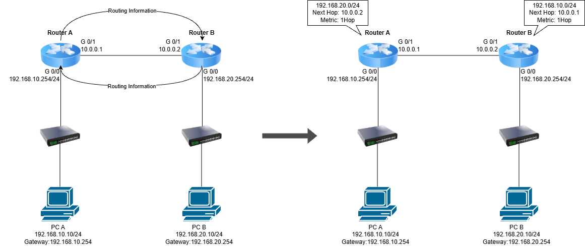
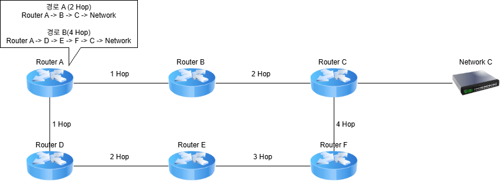
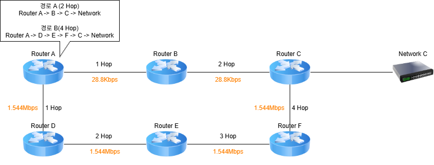

# RIP (Routing Information Protocol)

## 개요

RIP(Routing Information Protocol)는 Router 간에 Routing 정보를 자동으로 교환하여 Routing Table을 구성하는 **Dynamic Routing Protocol**이다.

Distance Vector 방식의 Routing Protocol이며, 목적지까지의 **Hop Count**를 기준으로 경로를 선택한다.

RIP는 최대 15 Hop까지 지원하며, 16 Hop은 목적지에 도달할 수 없는 것으로 판단한다.

RIP의 디폴트 라우팅 업데이트 주기는 30초 이다.

---

## RIP란?

* Dynamic Routing Protocol
* Distance Vector 방식으로 동작
* Router 간 Routing 정보를 자동으로 교환
* Hop Count를 Metric으로 사용
* 최대 15 Hop까지 지원
* 16 Hop은 Unreachable로 판단
* RIPv1과 RIPv2가 존재
* 소규모 네트워크에서 사용하기 적합

---

## RIP 동작 방식

RIP는 주변 Router에게 자신이 알고 있는 네트워크 정보를 주기적으로 전달한다.

예를 들어 다음과 같은 네트워크가 있다고 가정한다.

<p align="center">
  
</p>

Router A는 자신의 Routing 정보를 Router B에게 전달하고, Router B 역시 자신의 Routing 정보를 Router A에게 전달한다.

결과적으로 Router A는 다음과 같은 경로를 학습할 수 있다.

```text
R 192.168.20.0/24 [120/1] via 10.0.0.2
이때 via 10.0.0.2가 바로 Next Hop이다
```

---

## Hop Count

RIP는 목적지까지 거쳐가는 Router의 개수를 **Hop Count**로 계산한다.

예시

<p align="center">
  
</p>

Router A에서 Network C까지의 경로는 2개의 Router를 거치므로 RIP Metric은 2 Hop이 된다.

RIP에서는 Hop Count가 낮은 경로를 우선적으로 선택한다.

---

## RIP Metric

RIP에서 사용하는 Metric은 **Hop Count**이다.

예시

<p align="center">
  
</p>

RIP는 경로 A를 선택한다.

```text
1 Hop < 2 Hop
```

단, Hop Count가 낮다고 해서 실제 네트워크 성능이 더 좋은 것은 아니다.

RIP는 Bandwidth, Delay, Load 등의 요소를 고려하지 않고 Hop Count만을 기준으로 경로를 선택한다.

---

## RIP의 최대 Hop Count

RIP는 최대 15 Hop까지 사용할 수 있다.

```text
1 ~ 15 Hop
→ 사용 가능한 경로

16 Hop
→ Unreachable
```

따라서 대규모 네트워크에서는 RIP의 확장성에 한계가 있다.

---

## RIPv1과 RIPv2

RIP에는 RIPv1과 RIPv2가 있다.

| 구분                | RIPv1           | RIPv2           |
| ----------------- | --------------- | --------------- |
| 방식                | Distance Vector | Distance Vector |
| Classless         | 지원하지 않음         | 지원              |
| VLSM              | 지원하지 않음         | 지원              |
| CIDR              | 지원하지 않음         | 지원              |
| Subnet Mask 전달    | 전달하지 않음         | 전달              |
| 업데이트 방식           | Broadcast       | Multicast       |
| Multicast Address | 사용하지 않음         | 224.0.0.9       |

RIPv2는 Subnet Mask 정보를 함께 전달하기 때문에 VLSM과 CIDR을 지원한다.

따라서 현재 Cisco 환경에서 RIP를 실습할 때는 일반적으로 **RIPv2를 사용한다.**

---

## RIPv2 설정

Cisco IOS에서는 `router rip` 명령어를 사용하여 RIP를 활성화한다.

기본적인 설정 과정은 다음과 같다.

```text
Router(config)# router rip
Router(config-router)# version 2
Router(config-router)# network [Network Address]
```

예시

```text
Router(config)# router rip
Router(config-router)# version 2
Router(config-router)# network 192.168.10.0
Router(config-router)# network 10.0.0.0
```

이렇게 설정하면 해당 네트워크에 연결된 Interface에서 RIP가 동작하고 Routing 정보를 교환한다.

---

## Packet Tracer 설정 예시

다음과 같은 네트워크를 구성한다고 가정한다.

```text
192.168.10.0/24
      |
   Router A
      |
   10.0.0.0/30
      |
   Router B
      |
192.168.20.0/24
```

### Router A 설정

Interface 설정

```text
RouterA(config)# interface gigabitEthernet 0/0
RouterA(config-if)# ip address 192.168.10.1 255.255.255.0
RouterA(config-if)# no shutdown

RouterA(config)# interface gigabitEthernet 0/1
RouterA(config-if)# ip address 10.0.0.1 255.255.255.252
RouterA(config-if)# no shutdown
```

RIPv2 설정

```text
RouterA(config)# router rip
RouterA(config-router)# version 2
RouterA(config-router)# network 192.168.10.0
RouterA(config-router)# network 10.0.0.0
```

---

### Router B 설정

Interface 설정

```text
RouterB(config)# interface gigabitEthernet 0/0
RouterB(config-if)# ip address 10.0.0.2 255.255.255.252
RouterB(config-if)# no shutdown

RouterB(config)# interface gigabitEthernet 0/1
RouterB(config-if)# ip address 192.168.20.1 255.255.255.0
RouterB(config-if)# no shutdown
```

RIPv2 설정

```text
RouterB(config)# router rip
RouterB(config-router)# version 2
RouterB(config-router)# network 10.0.0.0
RouterB(config-router)# network 192.168.20.0
```

---

## RIP Routing Table 확인

RIP를 통해 학습한 경로는 Routing Table에서 `R`로 표시된다.

```text
Router# show ip route
```

예시

```text
R    192.168.20.0/24 [120/1] via 10.0.0.2
```

여기서

```text
R
```

은 RIP를 통해 학습한 Route를 의미한다.

```text
[120/1]
```

에서

```text
120
→ Administrative Distance

1
→ RIP Metric (Hop Count)
```

을 의미한다.

RIP의 기본 Administrative Distance는 **120**이다.

---

## RIP 설정 확인

RIP 설정 자체를 확인하려면 다음 명령어를 사용할 수 있다.

```text
Router# show ip protocols
```

예시

```text
Routing Protocol is "rip"
  Sending updates every 30 seconds
  Invalid after 180 seconds
  Holddown 180
  Flush after 240 seconds
  Default version control: send version 2, receive 2
```

이를 통해 현재 사용 중인 RIP Version과 RIP가 활성화된 Network 등을 확인할 수 있다.

---

## RIP의 Route 확인

RIP로 학습한 Route만 확인하려면 다음 명령어를 사용할 수 있다.

```text
Router# show ip route rip
```

예시

```text
R    192.168.20.0/24 [120/1] via 10.0.0.2
```

---

## RIP 업데이트 확인

RIP가 Router 간에 Routing 정보를 교환하는 과정을 확인할 수도 있다.

```text
Router# debug ip rip
```

예시

```text
RIP: received v2 update from 10.0.0.2
     192.168.20.0/24 via 0.0.0.0 in 1 hops
```

Debug 기능은 실제 장비에서는 CPU 사용량에 영향을 줄 수 있으므로 필요한 경우에만 사용하는 것이 좋다.

Debug를 종료하려면 다음 명령어를 사용한다.

```text
Router# undebug all
```

---

## RIP 통신 테스트

RIP를 통해 Routing Table이 정상적으로 구성되었다면 서로 다른 네트워크 간 통신이 가능하다.

예를 들어 PC-A에서 PC-B로 Ping을 수행한다.

```text
PC-A> ping 192.168.20.10
```

Router에서도 목적지까지의 경로를 확인할 수 있다.

```text
RouterA# ping 192.168.20.10
```

경로를 확인하려면 다음 명령어를 사용할 수 있다.

```text
RouterA# traceroute 192.168.20.10
```

PC에서는

```text
PC> tracert 192.168.20.10
```

을 사용할 수 있다.

---

## RIP 설정 삭제

RIP 설정을 삭제하려면 다음 명령어를 사용한다.

```text
Router(config)# no router rip
```

특정 Network 설정만 삭제할 수도 있다.

```text
Router(config)# router rip
Router(config-router)# no network 192.168.10.0
```

---

## RIP의 장단점

### 장점

* 설정 방법이 비교적 간단함
* Routing 정보를 자동으로 교환
* 소규모 네트워크에서 사용하기 쉬움
* 별도의 복잡한 Metric 계산이 필요하지 않음

### 단점

* 최대 15 Hop이라는 제한이 있음
* 대규모 네트워크에 적합하지 않음
* Hop Count만 사용하여 최적 경로를 판단
* 네트워크 변화에 대한 수렴 속도가 느림
* 주기적으로 Routing 정보를 교환하여 불필요한 Traffic이 발생할 수 있음

---

## Static Routing과 RIP 비교

| 구분                      | Static Routing | RIP          |
| ----------------------- | -------------- | ------------ |
| 방식                      | 정적 Routing     | 동적 Routing   |
| 경로 설정                   | 관리자 직접 설정      | 자동 학습        |
| 명령어                     | `ip route`     | `router rip` |
| Metric                  | 별도 Metric 없음   | Hop Count    |
| 경로 변경                   | 수동 변경          | 자동 업데이트      |
| Administrative Distance | 1              | 120          |
| 확장성                     | 낮음             | 낮음           |
| 적합한 환경                  | 소규모 / 단순한 네트워크 | 소규모 네트워크     |

---

## 핵심 정리

* RIP는 **Dynamic Routing Protocol**이다.
* Distance Vector 방식으로 동작한다.
* Router 간 Routing 정보를 자동으로 교환한다.
* **Hop Count**를 Metric으로 사용한다.
* 최대 15 Hop까지 지원하며 16 Hop은 Unreachable로 판단한다.
* RIPv2는 Classless Routing을 지원하며 Subnet Mask 정보를 전달한다.
* Cisco IOS에서는 `router rip` 명령어로 RIP를 활성화한다.
* `version 2` 명령어를 사용하여 RIPv2를 설정할 수 있다.
* Routing Table에서 RIP 경로는 `R`로 표시된다.
* RIP의 기본 Administrative Distance는 **120**이다.
* `show ip route rip`을 사용하여 RIP로 학습한 Route를 확인할 수 있다.
* `show ip protocols`를 사용하여 RIP 설정을 확인할 수 있다.

