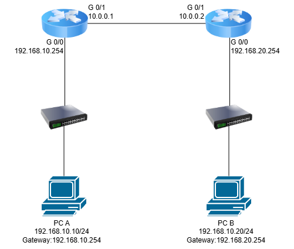

# Static Routing

## 개요

Static Routing은 관리자가 직접 목적지 네트워크와 경로를 지정하는 Routing 방식이다.

Router가 자동으로 경로를 학습하는 Dynamic Routing과 달리, 관리자가 `ip route` 명령어를 사용하여 Routing Table에 경로를 직접 등록한다.

소규모 네트워크나 경로가 변경되지 않는 네트워크에서 주로 사용한다.

---

## Static Routing이란?

* 관리자가 직접 Routing 경로를 설정
* `ip route` 명령어를 사용하여 경로 등록
* Routing Protocol을 사용하지 않음
* 네트워크 구조가 단순한 환경에서 적합
* 설정한 경로가 Routing Table에 등록되어 Packet Forwarding에 사용됨

---

## 네트워크 구성 예시

<p align="center">
  
</p>

---

## Static Routing 동작 과정

### 1. 목적지 네트워크 확인

Router가 Packet의 Destination IP Address를 확인한다.

예를 들어

```text
Destination IP
192.168.20.10
```

을 확인한다.

### 2. Routing Table 검색

Router는 Routing Table에서 `192.168.20.0/24` 네트워크로 가는 경로를 검색한다.

### 3. Static Route 확인

관리자가 미리 설정한 Static Route가 존재하면 해당 경로를 사용한다.

### 4. Next Hop으로 전달

설정된 Next Hop Router로 Packet을 전달한다.

```text
Router A
   |
   | Static Route
   ↓
Router B
   |
   ↓
192.168.20.0/24
```

---

## Static Route 설정

Cisco IOS에서는 다음 명령어를 사용한다.

```text
Router(config)# ip route [목적지 네트워크] [서브넷 마스크] [Next Hop IP]
```

예시

```text
Router(config)# ip route 192.168.20.0 255.255.255.0 10.0.0.2
```

의미

```text
목적지 네트워크 : 192.168.20.0/24
Next Hop       : 10.0.0.2
```

즉,

> `192.168.20.0/24` 네트워크로 가는 Packet은 `10.0.0.2` Router로 전달한다.

---

## Packet Tracer 설정 예시

### Router A

Router A의 인터페이스 설정

```text
RouterA(config)# interface gigabitEthernet 0/0
RouterA(config-if)# ip address 192.168.10.254 255.255.255.0
RouterA(config-if)# no shutdown

RouterA(config)# interface gigabitEthernet 0/1
RouterA(config-if)# ip address 10.0.0.1 255.255.255.252
RouterA(config-if)# no shutdown
```

Static Route 설정

```text
RouterA(config)# ip route 192.168.20.0 255.255.255.0 10.0.0.2
```

---

### Router B

Router B의 인터페이스 설정

```text
RouterB(config)# interface gigabitEthernet 0/0
RouterB(config-if)# ip address 10.0.0.2 255.255.255.252
RouterB(config-if)# no shutdown

RouterB(config)# interface gigabitEthernet 0/1
RouterB(config-if)# ip address 192.168.20.254 255.255.255.0
RouterB(config-if)# no shutdown
```

Router B에서도 반대 방향의 네트워크로 가는 경로를 설정한다.

```text
RouterB(config)# ip route 192.168.10.0 255.255.255.0 10.0.0.1
```

---

## Routing Table 확인

설정한 Static Route가 정상적으로 등록되었는지 확인할 수 있다.

```text
Router# show ip route
```

예시

```text
S    192.168.20.0/24 [1/0] via 10.0.0.2
```

여기서

```text
S
```

는 Static Route를 의미한다.

```text
[1/0]
```

에서 `1`은 Administrative Distance이며, Static Route의 기본 Administrative Distance는 `1`이다.

---

## Static Route 확인 명령어

### Routing Table 확인

```text
Router# show ip route
```

### Static Route만 확인

```text
Router# show ip route static
```

### 인터페이스 상태 확인

```text
Router# show ip interface brief
```

예시

```text
Interface              IP-Address      Status    Protocol
GigabitEthernet0/0     192.168.10.1    up        up
GigabitEthernet0/1     10.0.0.1        up        up
```

`Status`와 `Protocol`이 모두 `up`인지 확인한다.

---

## 통신 테스트

PC에서 `ping` 명령어를 사용하여 목적지까지 통신이 가능한지 확인할 수 있다.

```text
PC> ping 192.168.20.10
```

Router에서도 `ping`을 이용하여 Next Hop과 목적지의 연결 상태를 확인할 수 있다.

```text
RouterA# ping 10.0.0.2
RouterA# ping 192.168.20.10
```

경로를 확인하고 싶다면 `traceroute`를 사용할 수 있다.

```text
RouterA# traceroute 192.168.20.10
```

PC에서는 다음과 같이 사용할 수 있다.

```text
PC> tracert 192.168.20.10
```

---

## Default Static Route

모든 목적지에 대해 사용할 경로를 하나의 경로로 지정할 수도 있다.

이를 **Default Route**라고 한다.

```text
Router(config)# ip route 0.0.0.0 0.0.0.0 [Next Hop IP]
```

예시

```text
Router(config)# ip route 0.0.0.0 0.0.0.0 10.0.0.2
```

의미

```text
모든 목적지
    ↓
10.0.0.2로 전달
```

Routing Table에서는 다음과 같이 표시된다.

```text
S*   0.0.0.0/0 [1/0] via 10.0.0.2
```

`S*`에서 `*`는 Default Route임을 의미한다.

---

## Static Route 삭제

잘못 설정한 Static Route는 `no` 명령어를 사용하여 삭제할 수 있다.

기존 설정

```text
Router(config)# ip route 192.168.20.0 255.255.255.0 10.0.0.2
```

삭제

```text
Router(config)# no ip route 192.168.20.0 255.255.255.0 10.0.0.2
```

삭제 후 다음 명령어로 Routing Table을 확인한다.

```text
Router# show ip route
```

---

## Static Routing의 장단점

### 장점

* 설정 방법이 단순함
* 관리자가 경로를 직접 제어할 수 있음
* 불필요한 Routing Protocol의 Traffic이 발생하지 않음
* 소규모 네트워크에 적합
* 예측 가능한 경로를 구성할 수 있음

### 단점

* 네트워크 규모가 커질수록 관리가 어려움
* 네트워크 변경 시 관리자가 직접 설정을 변경해야 함
* Link 장애 발생 시 자동으로 다른 경로를 선택하지 못함
* 많은 Router를 관리할 경우 설정 작업이 증가함

---

## Static Routing과 Dynamic Routing 비교

| 구분               | Static Routing | Dynamic Routing            |
| ---------------- | -------------- | -------------------------- |
| 경로 설정            | 관리자 직접 설정      | Routing Protocol을 통해 자동 학습 |
| 설정 명령어           | `ip route`     | OSPF, EIGRP, RIP 등         |
| 경로 변경            | 직접 수정          | 자동으로 변경 가능                 |
| 관리 난이도           | 소규모에서 낮음       | 대규모에서 상대적으로 효율적            |
| Routing Protocol | 사용하지 않음        | 사용                         |
| 적합한 환경           | 소규모 / 단순한 네트워크 | 중·대규모 네트워크                 |

---

## 핵심 정리

* Static Routing은 관리자가 직접 경로를 설정하는 방식이다.
* Cisco IOS에서는 `ip route` 명령어를 사용한다.
* Routing Table에서 `S`로 표시된다.
* 기본 Administrative Distance는 `1`이다.
* 목적지 네트워크와 Next Hop을 지정하여 경로를 설정할 수 있다.
* `0.0.0.0/0`을 사용하면 Default Route를 설정할 수 있다.
* `show ip route`를 사용하여 Routing Table을 확인할 수 있다.
* 소규모 또는 경로가 단순하고 안정적인 네트워크에 적합하다.

