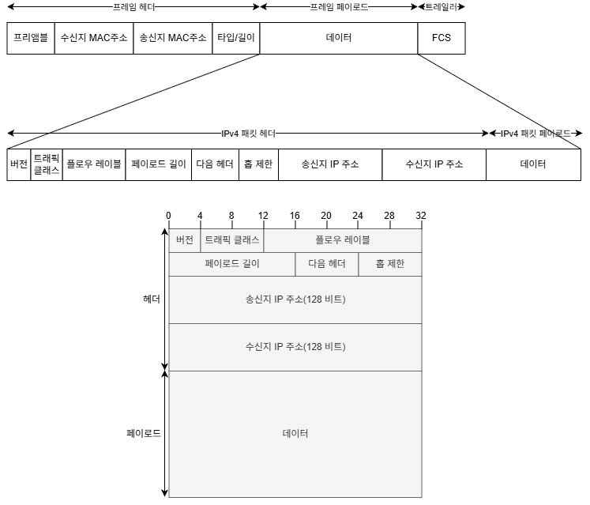

#  IPv6

## IPv6 패킷 헤더

  

## IPv6 헤더의 주요 정보

1. **버전 (Version)**: 현재 사용 중인 IP 프로토콜의 버전을 나타냅니다. IPv6이므로 숫자 '6'이 들어간다.
2. **트래픽 클래스 (Traffic Class)**: 패킷의 우선순위와 QoS 처리를 위해 사용됩니다. 혼잡 상황에서 특정 트래픽을 우선 처리하거나 
3. **플로우 레이블 (Flow Label)**: 특정 패킷 흐름(Flow)에 동일한 값을 부여하여 라우터가 해당 흐름의 패킷을 식별하고 일관된 방식으로 처리할 수 있도록 한다. QoS 등의 목적으로 활용할 수 있다.
3. **페이로드 길이 (Payload Length)**: IPv6 기본 헤더 이후에 이어지는 데이터의 길이를 나타냅니다. IPv4의 Total Length와 달리 IPv6 기본 헤더 자체의 40바이트는 포함하지 않는다.
4. **다음 헤더 (Next Header)**: IPv6 기본 헤더 다음에 어떤 헤더가 오는지를 나타냅니다. TCP(6), UDP(17), ICMPv6(58)와 같은 상위 계층 프로토콜뿐만 아니라 Extension Header를 지정할 수도 있다.
5. **홉 제한 (Hop Limit)**: 패킷이 네트워크에서 무한히 순환하는 것을 방지하기 위한 값입니다. 라우터를 하나 통과할 때마다 1씩 감소하며, 0이 되면 패킷이 폐기된다. IPv4의 TTL과 같은 역할을 한다.
6. **송신지 IPv6 주소 (Source Address)**: 패킷을 생성하여 전송한 송신자의 IPv6 주소이다.
7. **수신지 IPv6 주소 (Destination Address)**: 패킷이 최종적으로 전달되어야 하는 목적지의 IPv6 주소이다.

---
