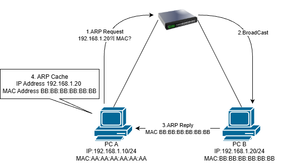

# ARP

## 개요
ARP는 IPv4 주소를 이용하여 해당 장치의 MAC 주소를 알아내기 위한 프로토콜이다.


## ARP 동작 과정 예시
<p align="center">
  
</p>

1. ARP Request
    * PC A는 192.168.1.20의 MAC 주소를 알기 위해 ARP Request를 전송한다.
    * ARP Request는 Broadcast로 전송되기 때문에 목적지 MAC 주소는 FF:FF:FF:FF:FF:FF
2. BroadCast
    * 같은 Broadcast Domain에 있는 장치들은 ARP Request를 받지만, 자신의 IP 주소와 일치하지 않는 장치는 응답하지 않는다.
3. ARP Reply
    * 192.168.1.20을 사용하는 PC B는 자신의 MAC 주소를 담은 ARP Reply를 PC A에게 전송한다.
    * ARP Reply는 일반적으로 *Unicast* 로 전달된다.
4. ARP Cache 저장
    * PC A는 알아낸 IP 주소와 MAC 주소의 대응 정보를 ARP Cache에 저장한다.
    ```text
    IP Address       MAC Address
    192.168.1.20     BB:BB:BB:BB:BB:BB
    ```
    * 따라서 같은 장치와 다시 통신할 때마다 ARP Request를 보낼 필요가 없다.

---

# ICMP

## 개요
ICMP (Internet Control Message Protocol)는 IP 네트워크에서 오류 보고와 네트워크 상태 확인을 위해 사용하는 L3 프로토콜이다. <br>
데이터를 전송하는 TCP나 UDP와 달리, ICMP는 제어 메시지를 전달하는 역할을 한다.
일반적으로 CMD창에 입력하는 PING, Ttacert명령어가 ICMP를 대표하는 명령이다.

## ICMP의 주요 역할
1. 오류 보고
    * 목적지에 도달할 수 없는 경우
    * TTL이 0이 되어 패킷이 폐기된 경우
    * 패킷에 문제가 있는 경우
2. 네트워크 진단
    * ping 명령으로 상대 호스트가 살아있는지 확인
    * traceroute(tracert) 명령으로 패킷이 거치는 경로 확인

---